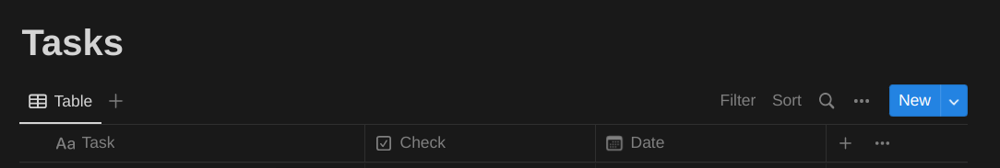

# Overview
My own implementation of a Python API for the Notion API.

## The Article

**[Automating Notion with Python](https://medium.com/@lucas-soares/automating-notion-with-python-abe3b1de2902)**

```
./article_automating_notion_with_python.ipynb
```

## Usage

1. Set your environment variables for the Notion Integration API key, and the database id in the `./notion_py_cli.py` script:

```
token = os.environ["NOTION_TOKEN"]
tasks_databaseId = os.environ["NOTION_TASK_DATABASE_ID"]
```

2. Then run the CLI tool
```
# To get a list of tasks in your database
python ./notion_py_cli.py --get todos

# To check a task
python ./notion_py_cli.py --check_task <task num in the database>

# To uncheck a task
python ./notion_py_cli.py --uncheck_task <task num in the database>
```
3. Here I am assuming that your Notion task database has this structure:




